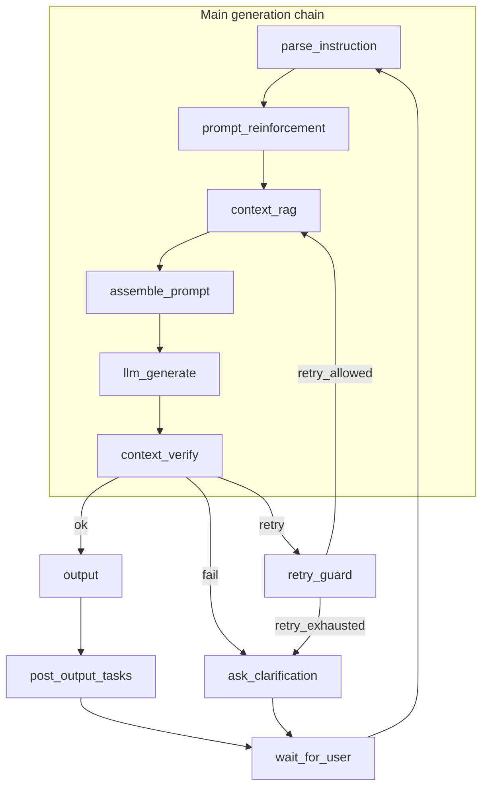

# Agent Orchestrator for Interactive Novel AI Platform (Shutu)

Interactive fiction platform: **context memory**, **knowledge-graph-aware RAG**, **hint recommendation**, and an **IF-Line** (branching narrative) experience. Product vision, data flow, and MVP phases are in **[README_E.md](./README_E.md)**.

This README focuses on the **LangGraph Story Flow orchestrator** implemented in Python.

---

## LangGraph Story Flow (v3)

The orchestrator is a **compiled `StateGraph`** with checkpointing (local dev) or platform-managed persistence (`langgraph dev` / LangSmith Studio). A full turn ends with **`interrupt_after`** on `wait_for_user`; the client resumes with `Command(resume=...)` and the graph loops back to `parse_instruction`.

### Topology (Mermaid)

The diagram below matches the runtime graph (same nodes and edges).  
*(If you use `print_orchestrator_mermaid.py`, LangGraph may also draw a decorative dashed edge from `context_verify` to `__end__`; that is not an application-defined branch.)*



`post_output_tasks` runs **sequentially**: `kg_update` → `hint_recommendation` → `user_management`.

### Node responsibilities

| Node | Role |
|------|------|
| `parse_instruction` | Validates session; resets per-turn fields (`retry_count`, `verify_*`, `assembled_prompt`, …). |
| `prompt_reinforcement` | Builds `reinforced_prompt` (user branch + style). |
| `context_rag` | Retrieves context + **KG read** → `assembled_context` (materials, not the final LLM prompt). |
| `assemble_prompt` | **Single place** that builds `assembled_prompt` `{ system, user, meta }` for traceability (player text first, then task, then context; retry hints from `verify_feedback` when `retry_count > 0`). |
| `llm_generate` | Calls the injected LLM using **only** `assembled_prompt`. |
| `context_verify` | Sets `verify_status` ∈ `{ ok, retry, fail }` via injected `VerifyService` (`VerifyResult.outcome`). |
| `retry_guard` | If `verify_status == retry`, either increments `retry_count` and routes to `context_rag`, or routes to `ask_clarification` when `retry_count >= max_retries`. |
| `ask_clarification` | User-visible clarification when verify **fails** or retries are **exhausted**; skips KG/hint side effects (`side_effects_status: skipped`). |
| `output` | On **ok**, sets `final_segment_text` from vetted text. |
| `post_output_tasks` | **Post-output only**: `kg_update` → `hint_recommendation` → `user_management`, then `side_effects_status: done`. |
| `wait_for_user` | Human-in-the-loop interrupt; next resume continues the session. |

### Routing constants

Defined in `backend/app/services/orchestrator/constants.py`:

- Verify: `ok`, `retry`, `fail`
- Retry guard: `retry_allowed`, `retry_exhausted` (stored in state as `retry_guard_route`, identical to conditional-edge keys)

### Default verification behavior

`DefaultVerifyService` checks **generated text** only: empty → **retry**, a small safety regex → **fail**, else **ok**. It does **not** detect logical contradictions or “adversarial” user instructions; extend `VerifyService` for KG/consistency or model-based judges.

### Dependency injection

`OrchestratorDeps` (`deps.py`) groups protocols/implementations: session, prompt, context RAG, KG, LLM, verify, hints, users. Pass at invoke time:

```python
config = {"configurable": {"thread_id": session_id, "orchestrator_deps": my_deps}}
```

---

## Repository layout

```
├── README.md                 # This file
├── README.zh.md              # Short Chinese pointer
├── README_E.md               # Product / architecture (English)
├── langgraph.json            # LangGraph CLI / `langgraph dev`
├── langgraph_entry.py        # Studio entry (graph without custom checkpointer)
├── requirements.txt
├── docs/
│   └── ORCHESTRATOR_DESIGN.md
└── backend/
    ├── app/services/orchestrator/
    │   ├── graph.py          # build_story_flow_graph, invoke_new_turn, …
    │   ├── state.py          # OrchestratorState
    │   ├── deps.py           # OrchestratorDeps, VerifyResult
    │   ├── constants.py      # route string constants
    │   └── nodes/            # One module per node + post_output_tasks
    ├── scripts/
    │   ├── print_orchestrator_mermaid.py
    │   └── run_orchestrator_langsmith.py
    └── tests/
        └── test_orchestrator_graph.py
```

---

## Generate the structure diagram

From the **repository root** (the directory that contains `backend/`):

```bash
# Mermaid text → paste into https://mermaid.live
PYTHONPATH=backend python backend/scripts/print_orchestrator_mermaid.py

# Save to file
PYTHONPATH=backend python backend/scripts/print_orchestrator_mermaid.py --out orchestrator_graph.mmd

# PNG (requires Graphviz; optional pygraphviz)
PYTHONPATH=backend python backend/scripts/print_orchestrator_mermaid.py --png graph.png
```

From inside `backend/`:

```bash
PYTHONPATH=. python scripts/print_orchestrator_mermaid.py
```

---

## Run locally

```bash
python -m venv .venv
source .venv/bin/activate   # Windows: .venv\Scripts\activate
pip install -r requirements.txt

# Smoke test (stub LLM if OPENAI_API_KEY unset)
PYTHONPATH=backend python -c "
from app.services.orchestrator import invoke_new_turn, default_orchestrator_deps
deps = default_orchestrator_deps()
r = invoke_new_turn('demo', {
    'session_id': 'demo',
    'current_node_id': 'root',
    'story_world_summary': 'A foggy forest at dusk.',
}, deps=deps)
print('final_segment_text:', (r.get('final_segment_text') or '')[:120])
print('hints:', r.get('hints'))
"

# Unit tests
cd backend && python -m unittest tests.test_orchestrator_graph -v
```

### LangSmith tracing

Set `LANGSMITH_TRACING=true`, `LANGSMITH_API_KEY`, and optionally `LANGSMITH_PROJECT` in `.env`, then:

```bash
PYTHONPATH=backend python backend/scripts/run_orchestrator_langsmith.py
```

### LangGraph Studio

```bash
pip install "langgraph-cli[inmem]"
langgraph dev
```

Open the Studio URL printed in the terminal (points at `http://127.0.0.1:2024` by default). Graph id: **`story_flow`**.

---

## Environment variables

Copy `.env.example` to `.env`. Typical keys: `OPENAI_API_KEY`, `ORCHESTRATOR_LLM_MODEL`, LangSmith variables, and (when wired) Neo4j Aura URI/credentials.

---

## License

See repository.
